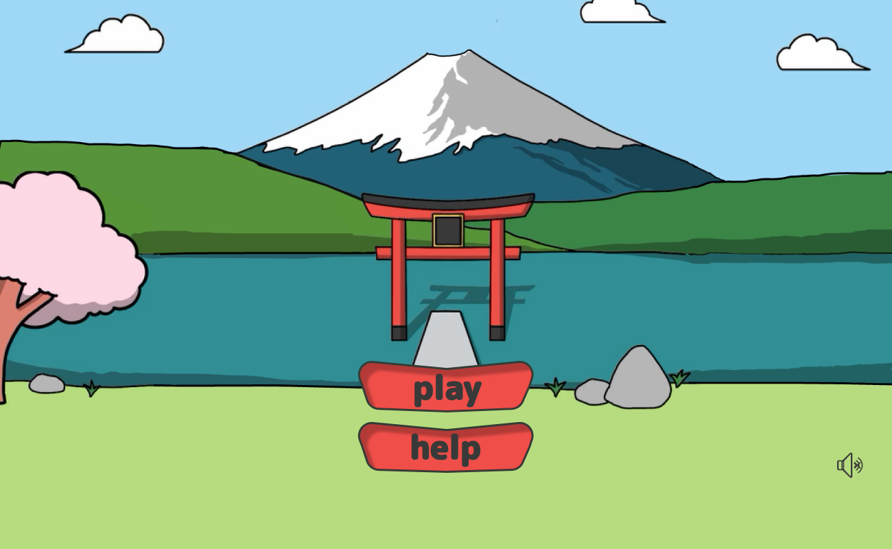
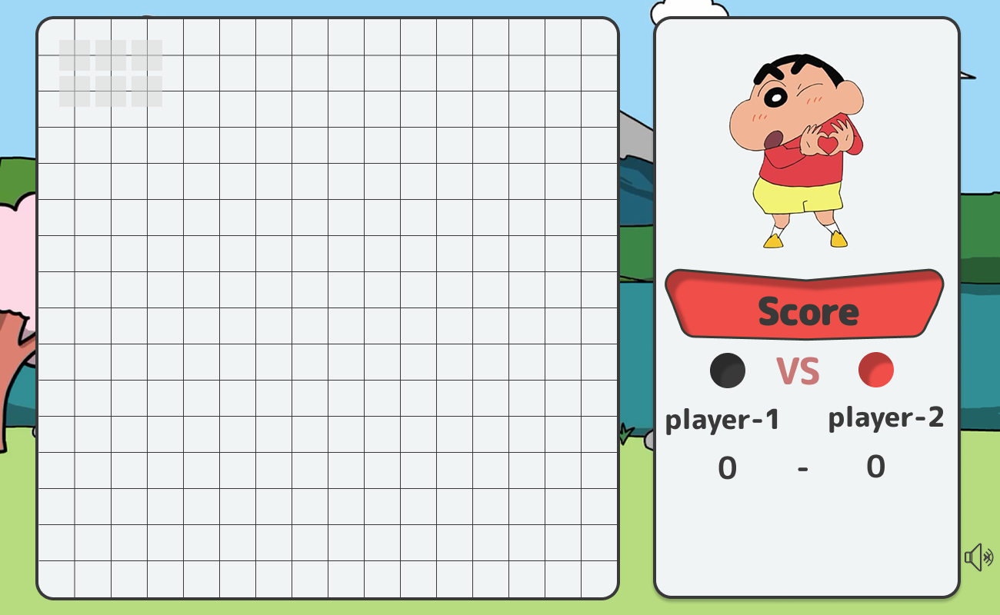
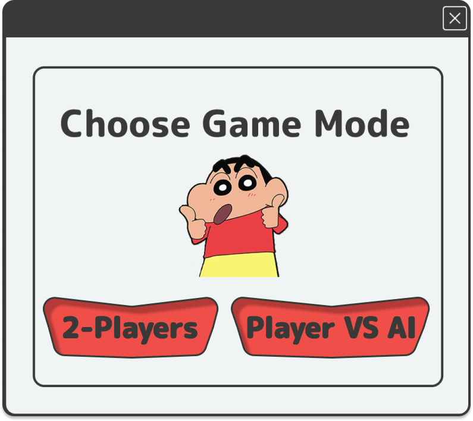

# 🎮 Gomoku AI Game – PyQt6 + Pygame Edition

A fun, AI-powered **Gomoku game** featuring a nostalgic **Shinchan-themed GUI**, built by a team of five as part of a university AI assignment!

Developed with 💖 using **Python**, **PyQt6**, **Pygame**, and packaged into an executable with **PyInstaller**.

---

## 🌟 Highlights

- 🎨 Fully custom-designed GUI (frameless, draggable, rounded borders)
- 🔊 Click sound effects and background music using **Pygame**
- 🧠 Intelligent AI opponents using **Minimax** and **Alpha-Beta Pruning**
- 👥 Game modes: **Player vs. Player** and **Player vs. AI**
- 🎁 Pre-built Windows executable included
- 🖌️ Designed with love in **Figma**

---

## 🖼️ Figma Design

Explore the full high-fidelity UI/UX prototype:

🔗 [Figma Design Link](https://www.figma.com/design/Pg1Q15DEMJnM80BeW5vvrt/Gomoku-game-design?node-id=0-1&p=f&t=U314VZBemRkKCMXT-0)

---

## 🧩 Demo & Screenshots

| Home Screen                     | Game Board                        | Mode Selection                      |
| ------------------------------- | --------------------------------- | ----------------------------------- |
|  |  |  |

📦 **Executable:** Included in the repository under `dist/GomokuGame.exe`

---

## 💻 How to Run

### Option 1: Run the Executable (Windows)

Navigate to the `dist/` folder and run:

GomokuGame.exe

No setup needed!

---

### Option 2: Run from Source (Python)

#### 1. Clone the repo

```bash
git clone https://github.com/salotch/Gomoku
cd Gomoku
2. Install dependencies
bash
Copy
Edit
pip install PyQt6 pygame
3. Run the game
bash
Copy
Edit
python game.py
Make sure all asset folders (images, audio) are in place and paths are set correctly using resource_path().

🧠 Built By
🎨 Salma – Full GUI implementation (Figma design, PyQt6 coding, packaging, UI polish)

🤖 Yara Hazem,
Marawan Shrief,
Abdelaziz Ali Al-Arabi
– AI logic using Minimax & Alpha-Beta Pruning

🤝 Feedback & Collaboration
We’d love your feedback!
Feel free to open an issue or fork the repo and build on it.

📝 License
For educational and personal use only.
All assets (images/audio) are used for non-commercial purposes.
```
